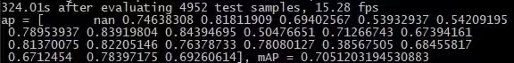
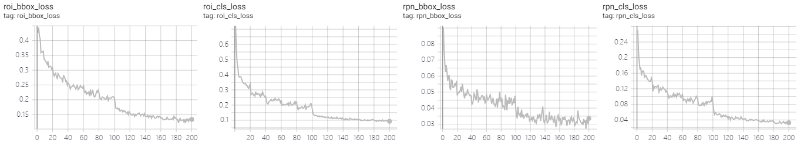
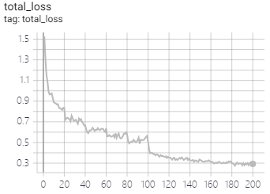
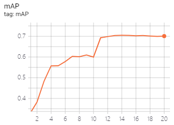
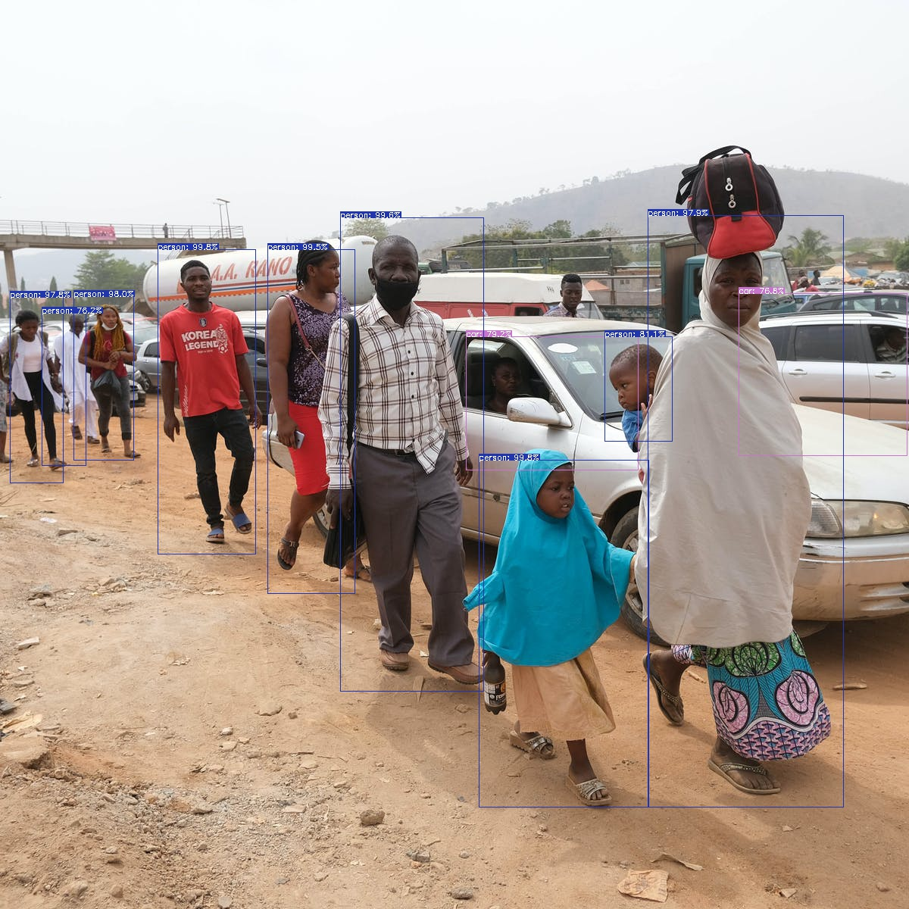
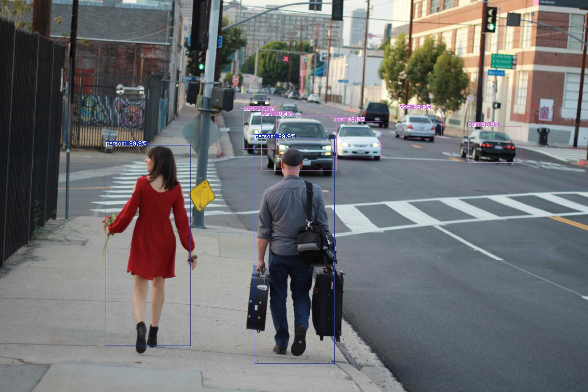
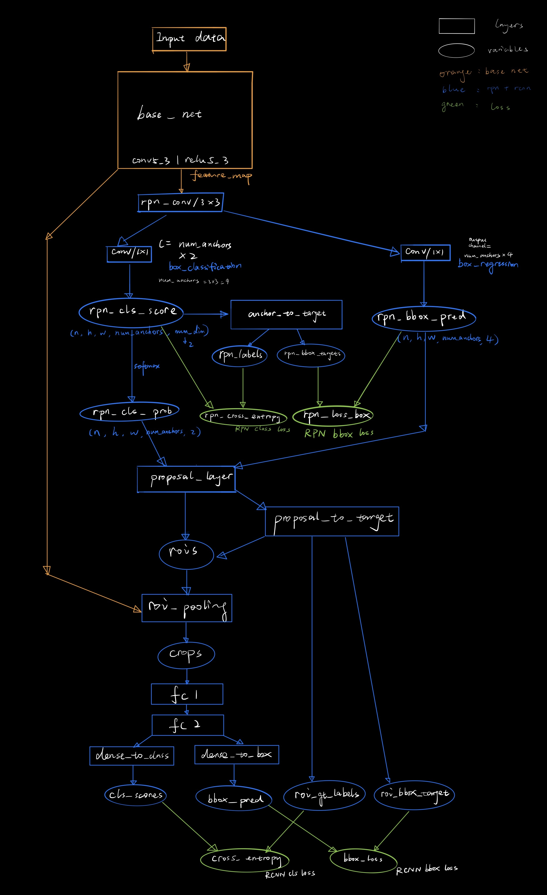

# A TensorFlow2 Implementation of Faster R-CNN

## 1. Introduction

This is a fast and concise implementation of Faster R-CNN with TensorFlow2 based on [endernewton](https://github.com/endernewton/tf-faster-rcnn) TensorFlow1 implementation and [other works](#acknowledgement).

The purpose and features of this repository:

- Recurrence of origin paper [\<Faster R-CNN: Towards Real-Time Object Detection with Region Proposal Networks\>](https://arxiv.org/abs/1506.01497) with superior performance.
- Concise ,flat and straightforward model architecture with abundant comments.
- Extend from tf1 to tf2 with Eager implementation and Graph Execution.
- A good start point for further inspection of classic two-stage object detection architecture.

### Performance

| Source | GPU | mAP | Inference Speed |
| :---: | :---: |  :---: |  :---: |
| origin paper | K40 | 0.699 | 5 fps |
| this repo | 2080Ti | 0.7051 | ~15 fps |



In order to be compatible with original setup, this result shown here is initialized with VGG16 ImageNet pretrained model and trained on Pascal VOC2007 `trainval` and tested on `test` dataset. The inference may need warm up to achieve the best speed.

## 2. Install and Setup

1. Clone this repository
   ```shell
   git clone 
   cd tf2-faster-rcnn
   ```
2. Install denpendencies with virtual env `anaconda`
   This project is trained and tested under Python3.7, TensorFlow v2.2 and cudatoolkit 10.1.
   ```shell
   conda create -n tf2 tensorflow-gpu cudatoolkit=10.1 
   conda activate tf2
   conda install numpy opencv cython scipy lxml
   ```
3. Build the Cython modules (optional)
   ```shell
   cd model/utils/nms
   python build.py build_ext --inplace
   ```

## 3. Usage

### 3.1 Train

1. Prepare Pascal VOC2007 dataset
   Download [VOCdevkit](http://host.robots.ox.ac.uk/pascal/VOC/voc2007/VOCdevkit_08-Jun-2007.tar), [VOCtrainval](http://host.robots.ox.ac.uk/pascal/VOC/voc2007/VOCtrainval_06-Nov-2007.tar), [VOCtest](http://host.robots.ox.ac.uk/pascal/VOC/voc2007/VOCtest_06-Nov-2007.tar) and extract all into `data/VOCdevkit`.
   ```code
   - VOCdevkit
        - VOC2007
        - VOCcode
        - ...
   ```
2. Download VGG16 ImageNet pretrained model(optional)
   If you want to initialize the training with ImageNet pretrained model and train from scratch, download [vgg16](https://storage.googleapis.com/tensorflow/keras-applications/vgg16/vgg16_weights_tf_dim_ordering_tf_kernels.h5) to `model/vgg16.h5`.
3. Download Pascal VOC2007 `trainval` dataset trained model weights to `model/ckpt/` from [Google Drive](https://drive.google.com/file/d/1hdTi7MMTSqWPrEfXr0UUifrSZTEf1iO2/view?usp=sharing).
4. Start training
   ```shell
   python train.py 
   ```
   Optional arguments:
   - `--scratch`: Use ImageNet pretrained vgg16 to train the model from scratch.
   - `--epoch <n>`: n = the number of epochs. Each epoch will train over `trainval` dataset once.
   - `--record_all`: Include kernel and gradient information in tensorboard summary.
   
   Training results viewed by tensorboard while training:
   ```shell
   tensorboard --logdir model/logs --bind_all
   ```
   
    

If you start the training first time, it will take some time to set up the dataset(preprocessing). After preprocessing the directory will contain `data/cache/voc_07_train_gt_roidb.pkl`, `data/cache/voc_07_test_gt_roidb.pkl`.

### 3.2 Test and Demo
- Test with VOC2007 `test` dataset:
    ```shell
    python test.py -i voc07_test
    ```
- Test with self defined images:
  Put your images under `demo/images`
  ```shell
  python test.py -i demo
  ```
- Optional arguments
  - `--unpop`: run test without popping up result images as a new window
  - `--save`: save result images to `demo/results`


Examples:
|||
| :---: | :---: |

image source: Internet

## Acknowledgement

This project is built based on the following great works:
- [endernewton's tf1 implementation](https://github.com/endernewton/tf-faster-rcnn)
- [py-faster-rcnn by Ross Girshick](https://github.com/rbgirshick/py-faster-rcnn)
- [chenyuntc's pytorch implementation](https://github.com/chenyuntc/simple-faster-rcnn-pytorch)

## Appendix
Faster R-CNN Model Structure:

